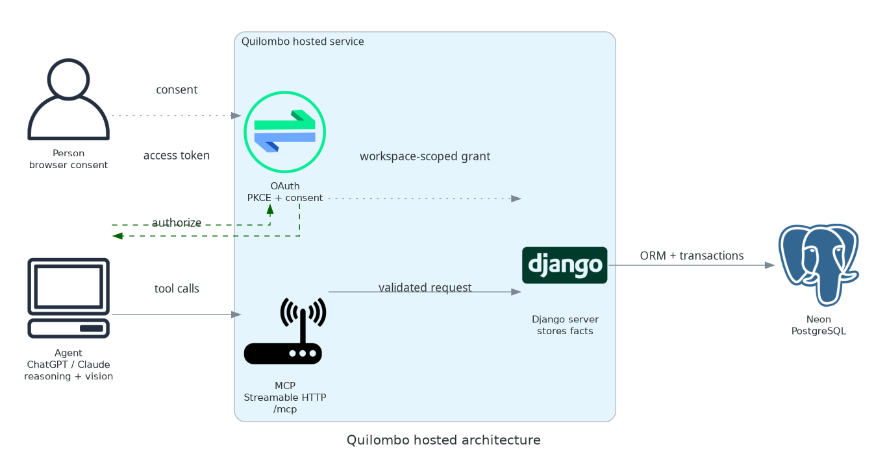

# Architecture



The hosted deployment keeps interpretation and storage in separate layers:

1. An agent such as ChatGPT or Claude interprets the user's request and any observations.
2. OAuth authorizes the agent for a workspace. Consent happens in the browser and is separate from
   inventory traffic.
3. The agent calls Quilombo through the MCP Streamable HTTP endpoint (`/mcp`).
4. Django validates workspace boundaries and writes inventory facts in transactions.
5. Neon PostgreSQL stores the tenant-scoped data.

Quilombo does not upload or interpret source media. The client can include provenance metadata when
it writes facts, while semantic reasoning remains with the agent or client.

## Regenerate

From the repository root, install Graphviz and run:

```bash
uv run --no-project --python 3.14 --with diagrams python docs/architecture_diagram.py
```

The generated image is written to `docs/_static/quilombo-architecture.png`.
